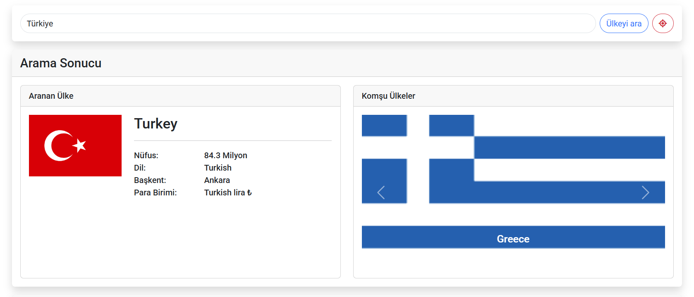
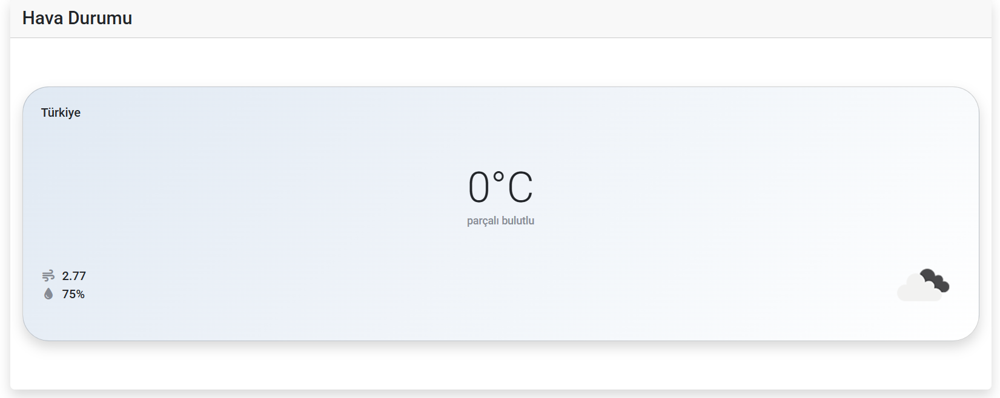

**Ülke ve Hava Durumu Bilgisi Projesi**

Bu proje, kullanıcıların bir ülkeyi aratarak ülkenin bilgilerine (nüfus, dil, başkent vb.) ve hava durumu detaylarına ulaşmasını sağlar. Ayrıca komşu ülkeler hakkında da bilgiler verir. Bootstrap ve JavaScript kullanarak modern bir tasarım ve etkileşimli bir deneyim hedeflenmiştir.

Özellikler

- Ülke Arama: Kullanıcı, girdiği ülke ismiyle ilgili temel bilgileri alır.

- Komşu Ülkeler: Aranan ülkeye komşu olan ülkelerin bayrak ve isim bilgileri gösterilir.

- Hava Durumu: Seçilen ülkenin hava durumu, sıcaklık, rüzgar hızı ve nem oranı bilgileri getirilir.

- Konum Butonu: Kullanıcının mevcut konumuna ait hava durumunu otomatik olarak getirir.

- Duyarlı Tasarım (Responsive): Bootstrap 5 sayesinde farklı ekran boyutlarına uyumlu görünüm sağlanır.

Kullanılan Teknolojiler

- HTML5: Sayfa yapısını oluşturmak için kullanıldı.

- CSS3 & Bootstrap 5: Tasarımı ve düzeni sağlamak, kartlar, grid sistemi ve responsive yapı için kullanıldı.

- JavaScript: Ülke ve hava durumu verilerinin API’lerden çekilmesi, DOM manipülasyonu, etkileşimli özellikler için kullanıldı.

- Font Awesome: İkonlar (örneğin konum ikonu) için kullanıldı.

Sayfanın Kullanımı

1. Ana Sayfa (index.html)

   Arama Kutusu: Ülke adı girilip “Ülkeyi ara” butonuna tıklayanak ülke bilgileri getirilir.

   Konum Butonu: Kırmızı butona tıklanarak tarayıcının konum erişimi kabul edilir ve bulunan konumun hava durumu bilgileri görüntülenir.

2. Arama Sonucu

   Aranan Ülke: Ülkenin bayrağı, nüfus, dil, başkent, para birimi gibi bilgiler burada listelenir.

   Komşu Ülkeler: Yan sütunda komşu ülkelerin bayrakları ve isimleri görüntülenir.

3. Hava Durumu

   Seçili ülkenin sıcaklık, hava durumu açıklaması, rüzgar hızı ve nem oranı gibi bilgiler görünür.

**Arama Sonucu ve Komşu Ülkeler Kartı**

**Hava Durumu Kartı**

